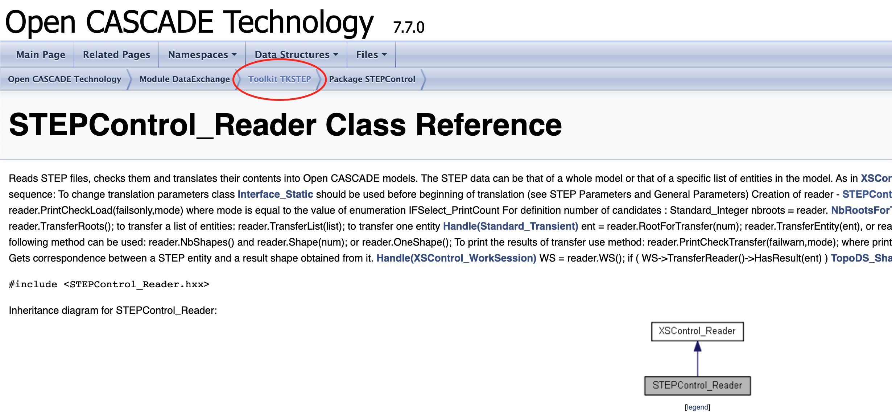

# Binding to OpenCascade Classes and Functions

OpenCascade is a huge C++ project, spanning mulitple decades. It has an impressive amount of functionality packed in, though it is somewhat hidden behind a (in my opinion) ugly/intimidating API.

One goal of this project is to expose a more ergonomic and approachable API on top of the goodies within OpenCascade so more people can use it to build cool things. OpenCascade leans pretty hard into C++, and so we need to use something more than just `bindgen` in order to have Rust call it safely.

For that we use [CXX](https://cxx.rs/), by dtolnay. CXX itself is also somewhat intimidating and hard to figure out on first use, so this document will hopefully show how _this_ project uses it to bind to OpenCascade and expose useful functionality.

## Organization

### `build.rs`

At the very bottom, we have the [opencascade-sys crate](../crates/opencascade-sys), which includes the OpenCascade source code in the [OCCT directory](../crates/opencascade-sys/OCCT).

This sys crate has a [build.rs](../crates/opencascade-sys/build.rs) file which calls out to `cmake` to configure and build the project. I've tried to disable as many features as possible which are unrelated to model building (such as FFMPEG, OpenGL, Tcl, basically anything related to visualization or infrastructure as we'll be building that ourselves in Rust).

In the theme of keeping it minimal, the OpenCascade libraries we statically link to are all explicitly laid out with `cargo:rustc-link-lib=static=LIB_NAME_HERE` cargo directives.

### C++/Rust Bridge File

In order to expose C++ types to Rust, and vice-versa, we need to write what cxx.rs calls a "bridge" file or module. This project currently has [one giant bridge file](../crates/opencascade-sys/src/lib.rs), but in the interest of organization this will eventually be broken up into sensible modules.

At the very top of the bridge module we can define types that are visible to both C++ and Rust, such as simple enums which can be represented as `u32`, for example.

Pretty much everything else goes inside of an `unsafe extern "C++" {}` block. Inside of this block, we declare opaque C++ types that we want Rust to know about. It is enough to simply state `type SOME_CPP_TYPE_HERE;` to make this declaration. `cxx` will then search included headers and make sure that type exists in the C++ world. With just the type, you can't really do anything, so you also need to start declaring functions that _should_ exist in the C++ world which you want to use.

There are some rules to how we define these functions in our code:

* At no point can a function in the bridge return a bare, owned C++ type. It must be behind an immutable reference, or a smart pointer such as `UniquePtr<T>` or `SharedPtr<T>`.
* If you're binding to a class method (not a free-floating function), you must use the `self` keyword as the first argument to the function.
    * If the method is `const` on the C++ side (not modifying `self`), then `fn do_something(self: &TheCPPTypeHere)` is sufficient.
    * If the method is _not_ `const`, then the signature must be `fn do_something(self: Pin<&mut TheCPPTypeHere>)`
    * Getting this wrong will result in ugly C++ compile errors getting spewed out on the console.
* If you're binding to a free-floating function, then avoid using the special `self` keyword as the name for a function argument, and just use `&T` and `Pin<&mut T>` as appropriate.
* From what I can tell, generics don't work from Rust to C++ templates. If you have a C++ type called `Handle<Edge>`, you'll need to declare your own C++ type called `HandleEdge` or whatever you want, and alias it to the full type (ex:`typedef opencascade::handle<Edge> HandleEdge;`
* You can use `#[cxx_name = "SomeCPPFunctionName"]` to tell `cxx` the _real_ name of the C++ function you want to use, and `#[rust_name = "some_rust_fn_name"]` to control what the name of the function is exposed to the Rust side of things. If you don't use these attributes, the exported Rust function is exactly the same as the C++ function name.

#### `construct_unique`

Providing bindings to C++ constructors is somewhat [tricky](https://github.com/dtolnay/cxx/issues/280) and not well supported in cxx. At the same time, we can't have functions with return `T` directly, it needs to return either a reference or a smart pointer as stated previously.

So in practice, most constructor functions exposed in this crate return a `UniquePtr<T>`. It would be tedious to have to manually define a C++ wrapper function for each and every constructor, so with the [clever use of templates](https://github.com/dtolnay/cxx/issues/280#issuecomment-1344153115) we can define one C++ function which follows a pattern of taking some number of arguments, calling the constructor of `T` with those arguments, and returning a `UniquePtr` to `T`:

```c++
// Generic template constructor
template <typename T, typename... Args> std::unique_ptr<T> construct_unique(Args... args) {
  return std::unique_ptr<T>(new T(args...));
}
```

Here is an example of binding to the constructor of `BRepPrimAPI_MakeBox`, which is a class which constructs...a box (the physical kind, not the Rust kind).

```rust
#[cxx_name = "construct_unique"]
pub fn BRepPrimAPI_MakeBox_ctor(
    point: &gp_Pnt,
    dx: f64,
    dy: f64,
    dz: f64,
) -> UniquePtr<BRepPrimAPI_MakeBox>;
```

With this declaration, we can bind to a C++ constructor and name it `BRepPrimAPI_MakeBox_ctor` on the Rust side without having to write any extra C++ code.

### wrapper.hxx

Sometimes automatic bindings with cxx just doesn't work out - you could be trying to access a static member of a class, cxx can't see through the polymorphism for a parent class method you're trying to call, or the constructor or function you're trying to call doesn't quite follow the `construct_unique` pattern shown above.

As a last resort, you can define your own wrapper C++ function to have the type signature and logic that you want.

Example: The `BRepAdaptor_Curve` class has a `Value()` function which returns `gp_Pnt` directly. Although `gp_Pnt` is a pretty trivial class with XYZ coordinates, we can't return it directly because of the rules imposed by cxx.

To work around this, I define a Rust function in the cxx bridge like so:

```rust
pub fn BRepAdaptor_Curve_value(curve: &BRepAdaptor_Curve, u: f64) -> UniquePtr<gp_Pnt>;
```

Then I add a C++ function with the same name in `wrapper.hxx`:

```c++
inline std::unique_ptr<gp_Pnt> BRepAdaptor_Curve_value(const BRepAdaptor_Curve &curve, const Standard_Real U) {
  return std::unique_ptr<gp_Pnt>(new gp_Pnt(curve.Value(U)));
}
```

This could possibly also be solved with a clever C++ template, I'm not sure.

## Example: Binding to the STEP File Import Functionality

In order to give a concrete "tutorial" on binding to new functionality in OpenCascade, I'll go over what was required to add STEP file import functionality to this crate. You can see all the changes for that functionality in [this PR](https://github.com/bschwind/opencascade-rs/pull/33).

You can see the rough outline of loading a STEP file in native OpenCascade code [here](https://dev.opencascade.org/doc/overview/html/occt_user_guides__step.html):

```c++
STEPControl_Reader reader;
reader.ReadFile("object.step");
reader.TransferRoots();
TopoDS_Shape shape = reader.OneShape();
```


### Step 1 - Declare the C++ types and functions in the bridge file
First we need to make the cxx bridge aware of the STEPControl_Reader type, and define a constructor function:

```rust
type STEPControl_Reader;

#[cxx_name = "construct_unique"]
pub fn STEPControl_Reader_ctor() -> UniquePtr<STEPControl_Reader>;
```

Mercifully, the reader constructor requires zero parameters. But the next step, reading a from a file, requires us to pass a String argument for the file name. cxx provides some facilities for converting between Rust strings and C++ strings, but now we'll have to define a function manually in `wrapper.hxx`.

```rust
pub fn read_step(
    reader: Pin<&mut STEPControl_Reader>,
    filename: String,
) -> IFSelect_ReturnStatus;
```

This returns a `IFSelect_ReturnStatus` so we also need to declare that type in the bridge file:

```rust
type IFSelect_ReturnStatus;
```

The cool part here is that `IFSelect_ReturnStatus` is just a simple enum, so we can actually declare a Rust enum of the same name inside of the bridge `ffi` module, but outside of the `unsafe extern "C++" {}` block:

```rust
#[derive(Debug)]
#[repr(u32)]
pub enum IFSelect_ReturnStatus {
    IFSelect_RetVoid,
    IFSelect_RetDone,
    IFSelect_RetError,
    IFSelect_RetFail,
    IFSelect_RetStop,
}
```

This means we can have functions which return `IFSelect_ReturnStatus` directly instead of dealing with it behind a reference or smart pointer.

### Step 2 - Write the wrapper C++ code

The wrapper functions usually end up being trivial, they usually just have an easy-to-bind signature from Rust and then do whatever translation is required. In this case, we're returning an enum that is declared

```c++
inline IFSelect_ReturnStatus read_step(STEPControl_Reader &reader, rust::String theFileName) {
  return reader.ReadFile(theFileName.c_str());
}
```

### Step 3 - Include the proper files in wrapper.hxx

In our case, we need to throw this include at the top of `wrapper.hxx`

```c++
#include <STEPControl_Reader.hxx>
```

### Step 4 - Declare the rest of the C++ functions

The next function to bind is `reader.TransferRoots()`. Its C++ definition looks like this:

```c++
Standard_EXPORT Standard_Integer TransferRoots(const Message_ProgressRange& theProgress = Message_ProgressRange());
```

Luckily we can bind directly to it with Rust:

```rust
pub fn TransferRoots(
    self: Pin<&mut STEPControl_Reader>,
    progress: &Message_ProgressRange,
) -> i32;
```

Note that `TransferRoots` is not a `const` function so we need to pass `Pin<&mut STEPControl_Reader>`.

Finally, there is `reader.OneShape()`:

```c++
Standard_EXPORT TopoDS_Shape OneShape() const;
```

Unfortunately, this returns a bare `TopoDS_Shape` so we can't directly bind to it, we'll have to create a wrapper C++ function.

```rust
pub fn one_shape(reader: &STEPControl_Reader) -> UniquePtr<TopoDS_Shape>;
```

and

```c++
inline std::unique_ptr<TopoDS_Shape> one_shape(const STEPControl_Reader &reader) {
  return std::unique_ptr<TopoDS_Shape>(new TopoDS_Shape(reader.OneShape()));
}
```

### Step 5 - Link to the OpenCascade libraries in `build.rs`

OpenCascade is split up into lots of smaller libraries, and sometimes if you're bringing in new functionality for the first time, you may need to link to a new library. Otherwise you'll run into huge amounts of linker errors if you try to build a binary based on this new code.

In the case of adding STEP file support, we need to link to five (!) different libraries. We'll add them in `build.rs`:

```rust
println!("cargo:rustc-link-lib=static=TKSTEP");
println!("cargo:rustc-link-lib=static=TKSTEPAttr");
println!("cargo:rustc-link-lib=static=TKSTEPBase");
println!("cargo:rustc-link-lib=static=TKSTEP209");
println!("cargo:rustc-link-lib=static=TKXSBase");
```

How do you know which libraries to link? If you look up `STEPControl_Reader` you'll likely arrive at [this page](https://dev.opencascade.org/doc/refman/html/class_s_t_e_p_control___reader.html). You can find the library name it's contained in here:



The rest of the libraries were found through trial and error. The linker will complain that symbols are missing, so copy-paste those symbols into a search engine, find them on OpenCascade's documentation site, and note which library they came from.

### Step 6 - Give it a nicer Rust API

Finally, we can create a higher level Rust function which reads a STEP file and returns a `Shape` primitive:

```rust
pub fn from_step_file<P: AsRef<Path>>(path: P) -> Shape {
    let mut reader = STEPControl_Reader_ctor();
    let _return_status =
        read_step(reader.pin_mut(), path.as_ref().to_string_lossy().to_string());
    reader.pin_mut().TransferRoots(&Message_ProgressRange_ctor());

    let inner = one_shape(&reader);

    // Assuming a Shape struct has a UniquePtr<TopoDS_Shape> field called `inner`
    Shape { inner }
}
```

Of course, a better version would inquire into the STEP translation process and return a `Result` so we can handle the case where something fails.
